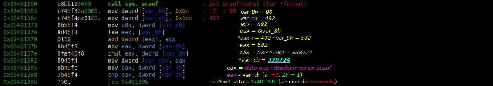

# Dont Patch Me

## Puntos
`300`

## Pista
None

## Flag
`bitup19{338724}`

## Adjuntos
* [Binario](files/aesu.exe) (MD5: 8407e7dc3c3f3af07d72c170836a4d2a)

## Deploy
None

## Descripcion
¿Alguna vez has querido crackear un programa? ¡Pues esta es tu oportunidad! Ahora bien, no será tan fácil como parchearlo y ya esta... no! Tendrás que entender el funcionamiento interno y obtener la clave del reto. Ah! lo bueno es que podras usar la clave como flag!

## Solucion
Se proporciona un archivo adjunto al reto. Se procederá al análisis del binario con la herramienta Radare, pero no importa cual utilices, pues la clave del reto se puede sacar simplemente echando un vistazo al disassembly y siguiendo la ejecución del programa. La instalación de radare la puedes encontrar en el propio [github](https://github.com/radare/radare2) donde se encuentra la herramienta.
Tras haber clonado el proyecto e instalado radare, además de esta (`r2`), tendremos un conjunto de herramientas que vienen con radare como `rabin2`,`radiff2`, `rax2`, etc. 

Primero, utilizaremos la herramienta `rabin2` con el archivo adjunto de tal forma: `rabin2 -I aesu.exe` con esto obtenemos información del binario entre la que podemos destacar que se trata de un PE (Portable Executable), de 32bits, little endian, desarrollado en lenguaje C, no tiene ninguna proteccion (canary,nx, etc...), stripeado y bueno... que es un ejecutable de windows.Abriremos el programa con radare con el comando `r2 aesu.exe`. 

Tras esto, haremos que radare haga unos breves análisis para poder clarificar el disassembly y que nos identifique funciones, etc; lo haremos con poniendo `aaa`, tras esto, listamos las funciones disponibles e identificamos rapidamente la funcion main, nos movemos a ella con `s main`. Ahora veremos el código en ensamblador correspondiente a esta función con el comando `pdf` (print disassembly function). No vamos a entrar a comentar todo el disassembly, pero si nos centraremos en 2 partes (que son casi las unicas y por cierto las relevantes): 

La primera parte va desde el `call sym.___main` al `call sym._scanf`, este bloque de disassembly corresponde a la parte donde el programa nos muestra un texto por el Standart Output y nos pide entrada de datos por el Standart Input o dicho de otra forma nos pide una contraseña que será la flag del reto. De esta primera parte vemos que llama a las funciones de printf y scanf (las basicas del lenguaje C para mostrar y recoger datos por consola), pero lo más importante es la instruccion `lea eax, [var_4h]` que esta cargando la dirección de memoria de la variable local `var_4h` en el registro eax y, me adelanto que será esta la que contendrá la password o mejor dicho, el código numérico que será la solución del reto (afirmo esto pues el scanf recibe como primer argumento `"%d"` que radare nos ayuda con la interpretación de la instruccion `mov dword [esp], 0x404024`). 

Y la segunda parte va desde el `call sym._scanf` al `jne 0x40139b`, que basicamente se resume en una serie de operaciones con unos valores locales que concluye con una comparacion entre dicho codigo generado por esas comparaciones y el codigo que hemos introducido (es decir, forma la contraseña a partir de una serie de valores que inicializa y con los cuales opera). Cuando llega a jne (jump if not equals) compara si el codigo que introducimos es el mismo que el que genera tras el scanf, si es igual nos muestra que la contraseña es correcta, sino pues que no lo es. Para explicarlo atomicamente, adjunto la siguiente imagen estableciendo el valor de los registros y variables importantes tras cada instrucción.

Cosas importantes a destacar: la instruccion `lea eax, [var_8h]` carga la direccion de memoria de var_8h en eax, es decir, como meter en eax un puntero que apunte a var_8h, por tanto, la siguiente operacion `add dword [eax], edx` suma a `[eax]` (los corchetes indican el contenido de dicha direccion de memoria que contiene el registro) el valor del registro edx, osea sería como poner: `*eax += edx` (si var_8h vale 1 y edx vale 3), el resultado sería 4 que se almacena en var_8h (porque escribe en el contenido al que apunta eax). Visto esto y con la imagen anterior, llegamos a dar con que el valor que queda en eax al comparar es 338724 que es la flag del reto.

## Notas
El nombre del reto nos sugiere que no podemos aplicar la estrategia de parchear, esta estrategia consiste en sobreescribir la comparación final para que siempre sea evaluado como nosotros nos interese. En el caso de ser un crackme que, si acertamos el codigo, nos diera la flag, simplemente cambiando ese `jne` por `je` siempre que la contraseña sea diferente a la que genera el codigo saltaríamos a la seccion de contraseña correcta y, por tanto, veríamos la flag. Pero en este reto, la flag, es el propio código generado por el programa, por eso no necesitamos ni tendría sentido parchear el binario. Por ello que tenemos que, o seguir el disassembly (las operaciones que se realizan y en que resultan) o directamente hacer debugging y poner un breakpoint tras la multiplicacion y, consultar el registro `eax`, donde estará el codigo final. O también, podemos hacer una emulación con ESIL y fijar el punto de partida (`s 0x00401365` && `aeim`) tras el scanf `mov dword [var_8h], 0x5a` y el punto de fin (`aesu 0x00401382`) en el `mov dword [var_ch], eax`. Y una vez inicializada la emulación con ESIL, consultar los valores de los registros con `aer` para observar el valor de eax donde estará el código (aunque ESIL suele utilizarse para cosas más complicadas, pero viene bien que, si podemos emular ese conjunto de instrucciones, para evitar equivocarnos, hacer la emulacion).

## Referencias
* https://github.com/Maijin/Workshop2015/tree/master/IOLI-crackme/bin-win32