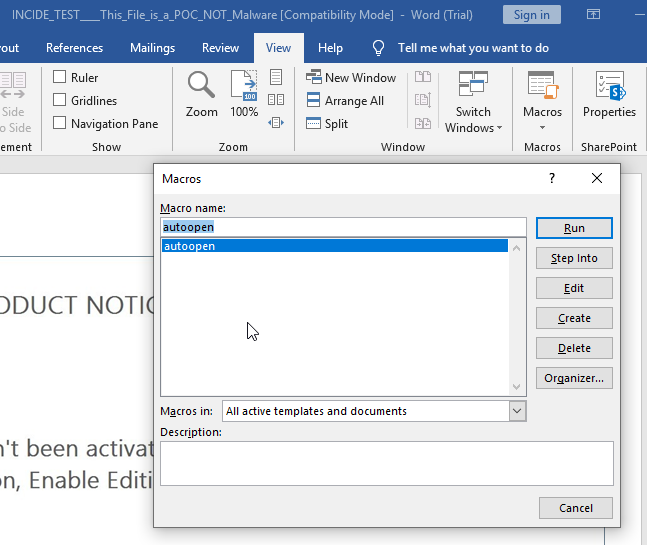

# Emotech

## Puntos
`600`

## Pista
None

## Flag
`bitup19{VbA_C4nB3_4_HeAd4ch3}`

## Adjuntos
* [Not_A_Malware.zip](files/not_a_malware.zip) (MD5: 68b3dae9d490399e25b7e293c10c9327)

## Deploy
None

## Descripcion
A veces, el ser humano tiende a hacer cosas que no reflexiona detenidamente, a veces... confiamos demasiado en el dominio que pensamos tener sobre algunas situaciones. Pues esta es la historia de una situación, un correo y un adjunto.  Y lo que sigue, tendrás que averiguarlo tú.

P.D: descubre y entiende lo que ha pasado, y encontrarás la flag.

## Solucion
Partimos de un fichero adjunto que simula ser el recibido en una campaña de phising. El fichero tiene la siguiente apariencia:

Parece un documento ofirmatico normal y corriente. Si lo abrimos nos encontramos con una alerta que nos indica que se requieren habilitar el contenido del documento (macros) y el siguiente contenido:

Si habilitamos el contenido veremos que se produce una ejecución de un programa que nos muestra un messagebox:

La anterior captura muestra que la macro que contiene el documento ha conseguido ejecución y eso es realmente grave. De hecho si somos precisos podemos ver la ruta donde se esta ejecutando este programa y podríamos saltarnos varios pasos, pero procederemos a analizar la macro del documento para ir paso por paso:

Si nos vamos a la pestaña de "View" y luego a "Macros" podemos observar el nombre de la macro `autoopen` lo que significa que se ejecutará con la apertura del documento (siempre y cuando este el contenido habilitado):

A continuacion, si pulsamos en "Editar" podremos ver el siguiente contenido de la macro:

Como podemos observar, dicho VBA esta ofuscado para dificultar el seguimiento de la ejecución, tiene la siguiente pinta:

Si procedemos a desofuscar el contenido parece que se clarifica un poco las acciones que sigue:

Podemos ver 2 funciones y cada una con gran importancia:

1. "**invocar()**: simplemente ejecuta un comando pasado por parametros desde un WScript.Shell que 
`es un objeto de nativo de Windows Shell que permite ejecutar programas locales, modificar contenido del registro, crear lnk o acceder al sistema de archivos`(Fuente: msdn). Es una "feature" de Microsoft, basicamente.
2. "**autoopen()**": esta función tiene una parte de "paja" que es la ejecución de dos comandos hardcodeados que son "ls y tasklist", y luego la parte interesante que es la ejecución de un codigo en powershell oculto y codificado en base64 (lo sabemos por el `-enc`) que parece extraer de un `Bookmark` llamado `one` y que le pasa a la función invocar junto con la cabecera que indica que programa ejecutar y cómo.

Para descubrir el contenido oculto del codigo powershell, vamos a revisar los Bookmarks, para ello nos dirigimos a la pestaña "Insertar", dentro de ella a "Links" y luego a "Bookmark".

Y vemos que hay un bookmark, efectivamente, llamado "one". Si pulsamos en "Go To" nos llevaremos una sorpresa, pues veremos que se sombrea una parte detrás de la imagen principal que vemos al abrir el documento:

Si desplazamos la imagen hacia abajo y seleccionamos todo el texto que hay, nos daremos cuenta que esta en blanco, por eso no se ve nada al mover la imagen. Si le cambiamos de color nos daremos cuenta que hay un texto en lo que parece ser codificación base64.

Si procedemos a descodificarlo, nos daremos cuenta que nos salen algunos carácteres no imprimibles, esto es porque esta codificado en Unicode (pues el `powershell.exe -enc` solo acepta base64 codificado como Unicode, si probamos con uno codificado en UTF-8 nos dará error).

Tras eliminar los caracteres no imprimibles nos queda el siguiente código en powershell que, como no, esta ofuscado:

Si procedemos a desofuscarlo parece darnos muchas pistas de lo que esta sucediendo:

Parece ser que el script tiene un listado de urls (en este caso solo 1) que splitea con el caracter `@` y sobre las cuales vuelca el contenido que le devuelven a un archivo en `$env:userprofile/475.exe` (que se corresponde al directorio principal del usuario, osea el "C:\Windows\Users\{tu_nombre_de_usuario}\475.exe") y es interesante que sea en este directorio pues generalmente el usuario suele acceder a el desde "Equipo/Disco Local C:" (en nuestro caso), vamos, que es un directorio que el usuario normal no suele tener mucha interacción.s

Importante también, que verifica que el tamaño del archivo sea mayor a 11Kb (con esto se verifica que la pagina de distribución del malware esta aun activa), sólo entonces, ejecuta el programa dropeado con la llamada `[Diagnostics.Process]::"start()"` (funcion legítima de Microsoft para iniciar procesos locales), a la que le pasa la ruta donde ha dropeado el ejecutable.

Y sobretodo, lo que vemos al final del script, es la primera parte de la flag `bitup19{VbA_C4nB3`, lo que nos sugiere que hay algo más. Aquí tenemos dos opciones:

1. Ir a buscar el ejecutable a la ruta de $env:userprofile y analizarlo (como veremos a continuación)
2. Visitar la página del cual se lo descarga y ver que encontramos.

Visitando la url que aparecía en el script de powershell vemos lo que parece ser el contenido de un ejecutable. Si buscasemos alguna de las cadenas que nos aparecían en el MessageBox (al ejecutarse la macro) podríamos ver la segunda parte de la flag que nos faltaba.

Pero sino nos hemos dado cuenta, lo descubriremos al analizar el ejecutable. 

Aquí tenemos varias opciones:

* Una cosa que podemos hacer es directamente listar los strings con la herramienta `rabin2` de la suite de `radare` y descubriremos la flag.

* Pero si tampoco lo hemos pensado, y nos guiamos, unicamente por los strings conocidos del MessageBox, si abrimos el ejecutable con radare veremos que se trata de un ejecutable de 32bits que esta stripeado, también lo podemos ver si le pasamos el flag de Info `-I` al rabin2.

Y sino lo hemos comprobado con rabin2, lo comprobaremos al analizar el ejecutable y mostrar las funciones.

Estando stripeado, será realmente dificil seguir el flujo, pero contamos con algo que conocemos, y son los strings del MessageBox. Radare nos permite buscar strings y filtrar por coincidencias, con el comando `iz ~` (es como si hicieramos un "mostrar funciones | grep"), si le pasamos el enlace de youtube veremos que da con una coincidencia, y en dicha coincidencia, mostrando un buen trozo de disassembly, veremos que aparece la parte restante de la flag `_4_HeAd4ch3}`.

Adicionalmente, también hay un codigo oculto en la url de la que se dropea el ejecutable, y es que la carpeta se trata de una representación hexadecimal de un grupo de telegram de analisis y desarrollo de malware al que os podeis unir: https://t.me/la_secta

## Notas
Este repo recrea partes de la campaña reciente de malware de Emotet que esta afectando a empresas Españolas. He dejado unos articulos interesantes en las referencias que pueden ser útiles e informativos acerca de estos vectores utilizados por los cibercriminales.

Por otro lado, también aporto dos herramientas muy interesantes para el análisis de VBA:
1. **VBAD**: herramienta de ofuscación de Macros en documentos ofirmáticos (es posible que se hayan utilizado en estas campañas de Emotet)
2. **ViperMonkey**: herramienta para procesar, analizar y emular VBA en Macros de documentos ofirmáticos (muy interesante desde la perspectiva blue para hacer un análisis estático sin necesidad de ejecutar la macro).

## Referencias
* https://docs.microsoft.com/en-us/previous-versions//at5ydy31(v=vs.85)?redirectedfrom=MSDN
* https://docs.microsoft.com/en-us/previous-versions//aew9yb99%28v%3dvs.85%29
* https://docs.microsoft.com/es-es/dotnet/api/system.diagnostics.process.start?view=netframework-4.8
* https://hacking-etico.com/2019/10/08/nueva-campana-del-malware-emotet-en-espana/
* https://www.cybereason.com/blog/one-two-punch-emotet-trickbot-and-ryuk-steal-then-ransom-data
* https://www.cybereason.com/blog/triple-threat-emotet-deploys-trickbot-to-steal-data-spread-ryuk-ransomware
* https://github.com/Pepitoh/VBad
* https://github.com/decalage2/ViperMonkey