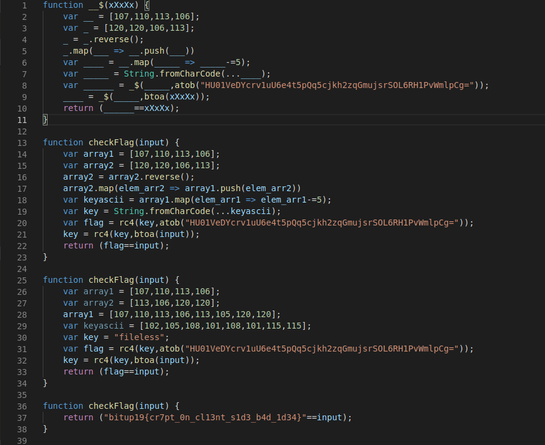

# JSDefuck

## Puntos
`70`

## Pista
None

## Flag
`bitup19{cr7pt_0n_cl13nt_s1d3_b4d_1d34}`

## Adjuntos
* [JSDefuck](files/jsdefuck.zip) (MD5: 670d51b4a7b3fac95e4bc7b721e2b771)

## Deploy
None

## Descripcion
¿Podrás dar con la flag? Recuerda, si es tuyo, puedes hacer con él lo que quieras.

## Solucion
Nos pasan un adjunto con un index.html donde parece que carga un script que hace unas validaciones en JS. 

Al principio se nos pide que introduzcamos una flag, la página la verifica y nos dice si es correcta o no. Parece que tiene la flag en su rutina de verificación y comprueba si la nuestra le coincide. 

Este reto parece hacer un RC4 decrypt a la cadena en base64 que tiene hardcodeada (parece ser la flag real). Es muy sencillo de sacar, simplemente ponemos un `console.log(______)` antes de la comparación final de lo que ha descifrado, y obtenemos la flag.

No obstante si se procede a desofuscar el código JS también acaba saliendo. A continuación se puede ver en 4 sencillos pasos:

## Notas
Las comprobaciones de backend nunca deben hacerse en JS en el lado del cliente, pues es código que se entrega al cliente en la respuesta HTTP y el cual puede manipular y modificar a su antojo.

## Referencias
  * https://gist.github.com/farhadi/2185197