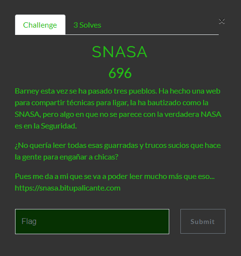

# SNASA

## Puntos
`700`

## Pista
None.

## Flag
`bitup19{s1mb0l1c_l1nkS_RuL3sS}`

## Adjuntos
None

## Deploy
* [SNASA Docker](files/snasa_deploy.zip) (MD5: a950b3fd43581d2d072737cf2a88de80)

Recuerda que puedes encontrar todos los archivos del despliegue en [deploy](deploy).

### Requerimientos
Se requiere tener instalados los siguientes programas para poder desplegar el reto:
* **Docker**
* **Docker-Compose**

### Pasos
Para desplegar el reto seguimos los siguientes pasos:

1. Verificamos el hash con el comando `md5sum snasa_deploy.zip` y el hash tiene que coincidir con el especificado en el README del proyecto.
2. Extraemos el contenido del comprimido con `unzip snasa_deploy.zip` (asegurate de no tener enlaces simbólicos :P).
3. Entramos dentro del directorio y tenemos que ver 3 subdirectorios (application,nginx y php) y un archivo (docker-compose.yml). Entonces simplemente usamos el comando `docker-compose build && docker-compose up` y podrás acceder al reto visitando http://localhost:8081
4. Dale permisos a las carpetas de uploads y tmp con el comando `chmod 777 ./tmp` y `chmod 777 ./uploads` (es necesario para que se puedan subir los archivos y no de un permision denied).

**Opcional:** puedes cambiar el puerto del reto dentro del archivo de docker-compose, así como demás configuraciones.

## Descripcion
Barney esta vez se ha pasado tres pueblos. Ha hecho una web para compartir técnicas para ligar, la ha bautizado como la SNASA, pero algo en que no se parece con la verdadera NASA es en la Seguridad. ¿No quería leer todas esas guarradas y trucos sucios que hace la gente para engañar a chicas? Pues me da a mi que se va a poder leer mucho más que eso... https://snasa.bitupalicante.com

## Soluciones

### Propuesta
Se nos habla de una plataforma web, que se supone que es para compartir trucos sucios de ligue, si visitamos la url proporcionada, nos encontramos una web en PHP que no parece tener demasiado.


Si consultamos el robots.txt veremos que hay un disallow de la ruta de /flag.php y de /upload.php


Si nos dirigimos a /flag.php veremos un mensaje que nos dice que tenemos que leer el archivo para dar con la flag. 


En cambio si nos vamos a la ruta /upload.php veremos que se trata de una especie de uploader, para subir dichas “técnicas” en formato zip.


Si inspeccionamos el codigo fuente, nos percatamos que hay un comentario que sugiere que existe un parámetro *debug* que puede que tenga alguna funcionalidad en el backend.


Si lo añadimos a la url veremos que se nos muestra el codigo del backend. Lamentablemente flag.php no tiene esta opcion habilitada (good try, try harder).


Tras analizar el código decidimos hacer una prueba de subida de ficheros. Si probamos a subir una cosa que no sea un zip, nos arroja un error de formato invalido. Al subir un zip, con un archivo de php dentro, también nos arroja un error, es decir, pide que obligatoriamente el zip contenga tan sólo imágenes.


Si lo resubimos una imagen valida, nos dice que se han subido los archivos correctamente. Si luego nos vamos a la carpeta /uploads que es donde se suben los archivos, veremos que se ha copiado ahí correctamente. (interesante ver en el codigo que tenemos acceso via web tanto a /uploads como a /tmp y /lib etc).


Si analizamos el codigo principal del backend del upload.php veremos que esta dividido en dos partes (cada switch define una parte):

1. Las comprobaciones y subida del fichero zip esperado.
2. Las comprobaciones y descompresion del fichero zip subido.


Si buscamos las librerias que se incluyen, hay una de extension.php en cuyo código se verifica que la extension del archivo sea una de las permitidas: solo imagenes validas, por tanto, no podemos saltarnos esa restriccion con bypasses conocidos como la doble extension, null byte, ni similar.


Pasamos a ver el proceso de la descompresión del archivo zip que se sube. Si nos fijamos, se mueve a  /tmp y ahí se comprueba que los ficheros que contiene el zip tiene extensión valida (con el procedimiento correcto).


Pero, si nos fijamos en el proceso de descompresión, vemos algo raro ahí. Se llama al binario de unzip para realizar descompresion, en vez de utilizar las funciones de la clase de ZipArchive de php, como se venia utilizando arriba. Si pensamos en un command injection, nos daremos cuenta que no es posible, pues las tres variables que se pasan al shell_exec estan, en cierto modo hardcodeadas o no son controlables por el usuario.


Hasta este momento tenemos los objetivos claros: 

* Tanto por la descripción del reto como por lo que hemos encontrado, hemos de leer algo (/flag.php) para dar con la clave del reto (Arbitrary File Read). 
* Pero solo tenemos un uploader y un supuesto descompresor de zips.
* Los archivos tiene que ser imagenes (pero solo se verifica por extension, y no contenido).
* Los archivos acaban en una ruta a la que tenemos acceso y con el mismo nombre que los subimos.

Tras discurrir un rato podemos llegar a la siguiente conclusion: "qué podemos usar para leer un archivo desde otro archivo (sin importar la extension)". Aquí será la parte más dificil del reto, y es llegar a la palabra "symblink" o "enlace simbólico". Puesto que es una de las formas que tenemos de llegar a un archivo sin poder movernos hacia él ni leer su contenido directamente.

Entonces, si lo que comprimimos es un enlace simbólico que apunte a la ruta en la que esta la flag, "../flag.php" (porque nuestro archivo acabará en /uploads, de ahi que necesitemos meter ese path transversal) podemos conseguir que, cuando se descomprima el enlace simbólico y acabe en la carpeta a la que tenemos acceso, si solicitamos ese archivo con una simple http request, lo que obtendremos será el contenido apuntado por este, osea el de flag.php. Podemos comprimir un enlace simbólico con el comando zip y utilizando el flag especial de *--symblinks*


Subimos ese fichero generado (importante que acabe con extesion valida), pasará las validaciones, y se descomprimirá en /uploads. Tan sólo queda hacer una peticion http (yo lo he hecho desde curl para que el navegador no me intente renderizar la imagen y así pueda ver el contenido en plano) y obtendremos el contenido del fichero apuntado por nuestro enlace simbolico, osea flag.php, donde veremos que en un comentario, esta la flag.


Puedes encontrar el zip utilizado para la explotación [aqui](files/test.zip)

### Alternativa @JorgeCTF (bonus: rce unexpected)
Hola, me llamo Jorge y soy miembro del equipo 4lk4x0f4, participante del CTF de BitUp Alicante 2019.

#### Descripción:



#### Web:


A primeras no vemos nada en el código, pero visitando /robots.txt obtenemos dos directorios.


Si visitamos /flag.php parece que nos va a sacar ya la flag pero...


Viendo esto pasamos al primer directorio: /upload.php


Si miramos el código fuente vemos un comentario como este:


Entramos y...

```php
<?php

if (!empty($_GET['debug'])) {
    highlight_file(__FILE__);
    exit();
}

require 'lib/uploader.php';

$error = "";
$right = false;
$movname = "";
if (!empty($_FILES)) {
    switch (Uploader::checkUploadFile($_FILES)) {
        case 0:
            $movname = md5(time()) . '.zip';
            if (!Uploader::uploadFile($_FILES['archivo'],$movname)){
                $error = 'No se ha podido subir el archivo correctamente';
            }
            break;
        case -1:
            $error = 'Sólo se permite subir un fichero a la vez';
            break;
        case -2:
            $error = 'Extension del fichero inválida (sólo se permiten zip)';
            break;
        default:
            $error = 'Error no contemplado';
    }

    if ($error==="") {
        switch (Uploader::checkSubfiles($movname)) {
            case 0:
                Uploader::unzip($movname);
                $right = true;
                break;
            case -1:
                $error = 'No se ha podido abrir el fichero zip';
                break;    
            case -2:
                $error = 'Detectado archivo dentro del zip que no esta permitido (sólo jpg,jpeg,png,gif)';
                break;    
            default:
                $error = 'Error no contemplado';
        }
    }
}

?>
```

Tras un rato estudiándolo llegamos a la conclusión de que, ¡no sirve para nada! De hecho, lo único que podemos sacar es que antes de descomprimir el zip lo renombra al md5(time()), lo cual nos da igual porque el zip, al fin y al cabo, es nuestro intermediario ;) 

Al ver el upload mi vena de [HTB](https://www.hackthebox.eu) casi estalla, pero me fijo en que solo admite __.zip__'s, por lo que ésta se me relaja un poco, aunque después de hacer unas cuantas pruebas y ver que lo que subimos comprimido en el zip se puede visitar en /uploads/, me vienen flashbacks del usuario en la máquina [Ghoul](https://www.hackthebox.eu/home/machines/profile/187) de HackTheBox.

Yo conseguí el usuario de esa máquina porque tenía una página en la que podías subir un zip, este se descomprimía y se dejaba el archivo en el servidor. Usando [evilarc](https://github.com/ptoomey3/evilarc), podíamos crear un archivo zip que contuviese una imagen para explotar una vulnerabilidad llamada [Directory/Path Traversal](https://www.owasp.org/index.php/Path_Traversal). 

Este zip pedía descomprimir al servidor un archivo como: ../../../../../var/www/html/mi_archivo.php, por lo que el servidor, al extraer el archivo, lo dejaba en ese directorio. No obstante, en este reto no funcionaba esta técnica porque, al no saber en qué directorio se encontraba el servidor web, íbamos a ciegas.

#### Explotación

Varios zumos y horas después, se nos ocurre pedirle a evilarc que nos lo ponga en /uploads/, con una __depth__ de 0, por lo que el servidor descomprimiría el archivo y lo llevaría a /uploads/ en la misma carpeta en la que lo dejaba al descomprimirlo. 

```bash
echo "<?php echo system('ls') ?>" > try.png
```
```bash
python evilarc.py try.png -p /uploads/ -o unix -f try.zip -d 0
```

Subimos el zip, lo mandamos al repeater con [burp](https://portswigger.net/burp) y nos queda esto:


En la foto podemos ver los [magic bytes](https://en.wikipedia.org/wiki/List_of_file_signatures) de los archivos __.zip__, seguido de la carpeta /uploads/ y del archivo try.png en el que introduciremos nuestro código malicios en php.

Lo subimos y visitamos /uploads/try.png


Sabiendo esto, solo nos queda engañar al servidor para que se "trague" nuestro .php malicioso cambiando la request en burp. Tras un buen rato y bastantes intentos, llegamos a esta request final:


`/uploads/code.php.php` -> Nuestro archivo, el cual vamos a visitar para que el siguiente código se ejecute en el lado del servidor.

`` -> Al principio inyectamos esto porque pensábamos que solo teníamos inyección de HTML, pero al luego añadir código en php vimos que teníamos el control total del archivo y la ejecución del mismo.

`<?php echo system("cat ../*"); ?>` -> Con este código leemos todos los archivos de la carpeta superior, ya que no podíamos leer solo flag.php, y conseguimos la flag.

`?>` -> No me preguntéis por qué, pero sin este cierre no se ejecutaba el código.


#### Conclusión 

Agradecimientos a [BitUp](https://bitupalicante.com/), en especial a [Secu](https://twitter.com/secu_x11) por la organización y excelente soporte en el desarrollo del CTF, y a mis compañeros del Team Alcachofa!

[JorgeCTF](https://twitter.com/jorge_ctf)

## Notas
Los enlaces simbolicos no siempre pueden extraerse como tal y referenciar a un recurso relativo, si hacemos la extraccion con la función extractTo() de la libreria de ZipArchive de PHP no funcionará, pero en cambio utilizando el binario unzip si que lo descomprime respetando los enlaces simbolicos.

## Referencias
* https://linux.die.net/man/1/zip
* https://fwhibbit.es/symlink-hacking-shared-hosting
* https://www.php.net/manual/es/ziparchive.extractto.php