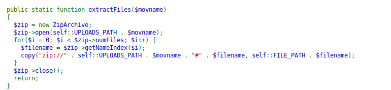
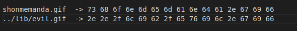
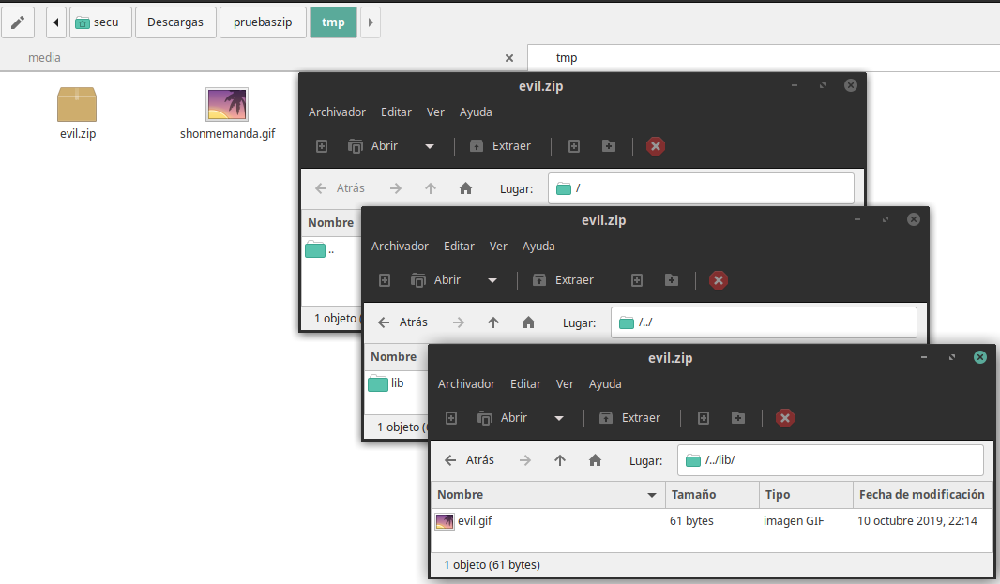

# SNASA2

## Puntos
`1000`

## Pista
None.

## Flag
`bitup19{3p1c_P4tH_Tr4nSvers4l_&_LF1}`

## Adjuntos
None

## Deploy
* [SNASA2 Docker](files/snasa2_deploy.zip) (MD5: ea4705d4ea997d81c73ffd0be53295da)

Recuerda que puedes encontrar todos los archivos del despliegue en [deploy](deploy).

### Requerimientos
Se requiere tener instalados los siguientes programas para poder desplegar el reto:
* **Docker**
* **Docker-Compose**

### Pasos
Para desplegar el reto seguimos los siguientes pasos:

1. Verificamos el hash con el comando `md5sum snasa2_deploy.zip` y el hash tiene que coincidir con el especificado en el README del proyecto.
2. Extraemos el contenido del comprimido con `unzip snasa2_deploy.zip`.
3. Entramos dentro del directorio y tenemos que ver 3 subdirectorios (application,nginx y php) y un archivo (docker-compose.yml). Entonces simplemente usamos el comando `docker-compose build && docker-compose up` y podrás acceder al reto visitando http://localhost:8082
4. Dale permisos a las carpetas de uploads, tmp y lib (esta ultima para que funcione la vulnerabilidad aunque con si no lo desplegaramos con docker y el propietario fuera www-data funcionaría igual) con el comando `chmod 777 ./tmp`, `chmod 777 ./uploads` y `chmod 777 ./lib` (es necesario para que se puedan subir los archivos y no de un permision denied).

**Opcional:** puedes cambiar el puerto del reto dentro del archivo de docker-compose, así como demás configuraciones.

## Descripcion
Después del desastre de la version 1 de la plataforma SNASA, Barney decidió mejorarla y solucionar los bugs existentes que nos permitieron hacernos con el control de la plataforma, pero... eso no le hizo detenerse. Le enseñaremos que nunca puede fiarse de los archivos que alguien te pasa. https://snasa2.bitupalicante.com

## Solucion
Este reto es una readaptación del reto de SNASA version 1 con una explotación muy curiosa.

Si vistamos la web que nos dan la descripcion, veremos que es el mismo diseño que SNASA version 1, pero con pequeñas diferencias.

Del SNASA 1, sabemos que con el parametro debug en la url vemos el contenido del archivo.
Pero tras analizar el backend descubrimos varias cosas diferentes con la version 1:

* Ya no esta la llamada a unzip con la función "exec()", ahora es sustituida por un bucle con la función "copy()" que extrae el fichero utilizando la envoltura "zip://".
* La clave del asunto, en el upload.php se ha sustituido el require por un include de todos los ficheros de "lib/".

Y es aquí donde descubrimos dos vulnerabilidades:

1. La función copy (que recibe por primer argumento el fichero origen y por segundo argumento el fichero destino) recibe como fichero destino los siguientes valores: `self::FILE_PATH . $filename`. A simple vista puede no parecer grave, puesto que FILE_PATH no lo controlamos, pero $filename si, pues este es el nombre que toma el archivo, es decir cada uno de los archivos que figuran dentro del zip.
2. La inclusión de todos los archivos de un directorio puede dar pie a una inclusión de un fichero local (LFI) con posterior ejecución de código, pues cuando incluyes un archivo, lo que estas haciendo es evaluarlo.

De los dos punto anterior podemos extraer la siguiente conclusión: si conseguimos situar un archivo (del tipo que sea) dentro del directorio de ./lib si incrustamos codigo php en su interior se ejecutará. Y podemos escribir un fichero en dicho directorio mediante un path transversal en el filename de uno de los archivos dentro del zip.

La dificultad tras esta deducción es dar con la manera de conseguir llamar a un archivo `../lib/loquesea.extension`, pues los nombres de archivos en unix no pueden contener '/'. Para ello lo que haremos es calcular el numero de carácteres que necesitamos para formar el path transversal completo y posteriormente machacar el zip con un editor hexadecimal.

Ejemplo: Queremos conseguir el siguiente nombre `../lib/evil.gif` (importante que la extension sea valida pues sino la descompresion no sucederá). El anterior nombre son 15 caracteres, por tanto necesitaremos crear un archivo con un nombre de 15 carácteres, por ejemplo "shonmemanda.gif". 

Si cogemos la cabecera de un gif válido, incluso al comprobar su contenido saldría que se trata de un GIF. Pero al evaluarlo ejecutaria ese codigo php incrustado.

Y para editar el zip simplemente podemos hacerlo con un editor hexadecimal como lo es `hexedit`. Sustituyendo el valor del nombre en hexadecimal por nuestro nombre con path transversal deberia quedar algo así:

Una vez confeccionado el zip, solo tenemos que subirlo en el uploader, y al descomprimirlo quedará situado en ./lib y entonces, si accedemos al upload.php de nuevo, veremos como se esta evaluando nuestro codigo.

Es entonces cuando podemos ejecutar comando y leer el contenido del flag.php y con ello la flag del reto.

Puedes encontrar el zip utilizado para la explotación [aqui](files/evil.zip)

## Notas
Y es por esto que en alguna vez hemos oido hablar de la tecnica de hardcodead codigo php en los metadatos de una imagen, lo que se olvida aclarar que solo funciona cuando hay LFI, pues sino dicho código no se va a ejecutar. También destacar que esto no funciona con unzip o extracTo (ZipArchive), pues el primero se salta el path transversal y el segundo ignora las carpetas y lo extrae todo en el destino que le pongas (sin dejar las carpetas).

## Referencias
* https://en.wikipedia.org/wiki/File_inclusion_vulnerability#Local_File_Inclusion
* @Mituga