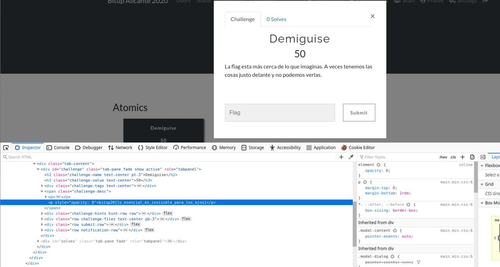

# Demiguise

## Puntos

`50`

## Pista

None

## Flag

`bitup20{lo_esencial_es_invisible_para_los_ojos}`

## Adjuntos

None

## Deploy

None

## Descripcion

La flag esta más cerca de lo que imaginas. A veces tenemos las cosas justo delante y no podemos verlas.

## Solucion

Si se inspecciona el código HTML del reto, se descubrirá que la flag esta en el código HTML del reto con opacidad al máximo y eso la hace invisible en la vista renderizada.

## Referencias

None
