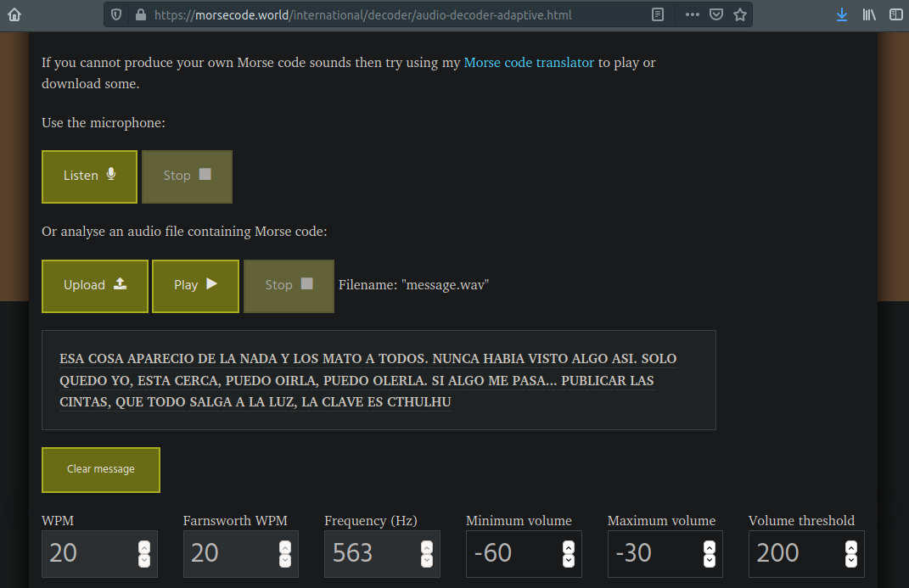

# Helius 5

## Puntos

`100`

## Pista

None

## Flag

* `bitup20{Cthulhu}`
* `bitup20{cthulhu}`
* `bitup20{CTHULHU}`

## Adjuntos

* [message.wav](files/message.wav) (MD5: c77197478ff6e9b13ecfa7291b493f26)

## Deploy

None

## Descripcion

El 20 de abril de 2020 encontramos el barco Helius 5 que había salido de las costas de Miami y con rumbo a Dakar (Senegal), realizaba unas investigaciones de alta seguridad, y fue encontrado en las cercanias al Triangulo de las Bermudas, según los registros viajaban en el 23 tripulantes, pero no se encontró a nadie en la embarcación, es como si todos hubieran desaparecido. Se halló, en la cabina del capitan, un pequeño ordenador con un archivo cifrado y un mensaje grabado, es quizás lo único que puede explicar que pasó allí.

P.D: el formato flag es `bitup20{LA_PALABRA_CLAVE_QUE_ENCONTRAREIS}`

## Solucion

Se entrega en el reto lo que parece ser un mensaje de audio en Morse. Se podría traducir el sonido a Morse, y luego traducir el Morse a texto, pero la forma más rapida de hacerlo, es utilizando [un decodificador de audio a morse](https://morsecode.world/international/decoder/audio-decoder-adaptive.html) subimos el archivo WAV adjunto, y al pulsar el play, a la vez que se reproduce, se va mostrando el mensaje, donde puede descubrirse, al final del mensaje, una especie de clave, que se trata de la flag del reto.

## Referencias

* https://morsecode.world/international/translator.html
* https://morsecode.world/international/decoder/audio-decoder-adaptive.html
