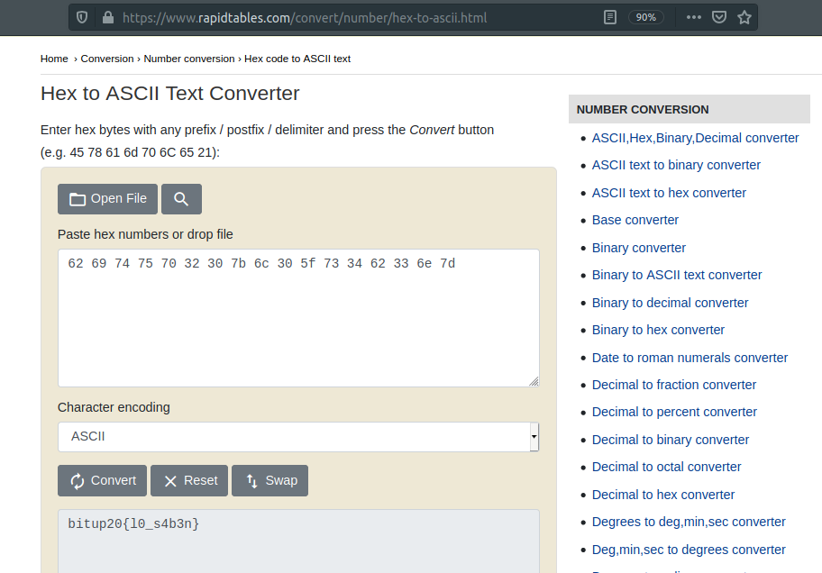

# Hexa

## Puntos

`50`

## Pista

None

## Flag

`bitup20{l0_s4b3n}`

## Adjuntos

None

## Deploy

None

## Descripcion

Conseguimos acceder al chat que utilizó el Dr. Lecter para avisar a Hobbs de nuestra llegada. Pero... por alguna extraña razón, no había aviso alguno, solo encontramos un mensaje con numeros y letras. No sabemos lo que significa, ¿podrás descubrirlo? El mensaje es:

```
62 69 74 75 70 32 30 7b 6c 30 5f 73 34 62 33 6e 7d
```

## Solucion

Se entrega en el reto lo que parece ser un mensaje codificado en base16 o hexadecimal, para poder obtener el mensaje original, deberemos pasar el mensaje de hexadecimal a código ascii, que es la representación que los humanos entendemos (numeros, simbolos, letras). Para ello podemos hacerlo de diferentes formas:

* En Linux utilizando el comando: `echo 626974757032307b6c305f733462336e7d | xxd -r -p`
* En Windows utilizando el comando de powershell: 
```powershell
$hexstring = "62 69 74 75 70 32 30 7b 6c 30 5f 73 34 62 33 6e 7d"
$asciichars = $hexstring -split ' ' |ForEach-Object {[char][byte]"0x$_"}
$asciistring = $asciichars -join ''
$asciistring
```
* En Mac utilizando el comando: `echo 626974757032307b6c305f733462336e7d | xxd -r -p`

O, si no se quiere utilizar la terminal, se puede resolver en la web de [rapidtables](https://www.rapidtables.com/convert/number/hex-to-ascii.html)



## Referencias

* https://www.rapidtables.com/convert/number/ascii-to-hex.html
* https://stackoverflow.com/questions/41762760/convert-hex-to-ascii-in-powershell
