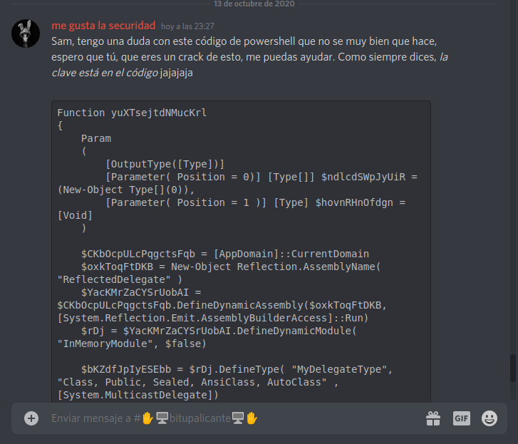
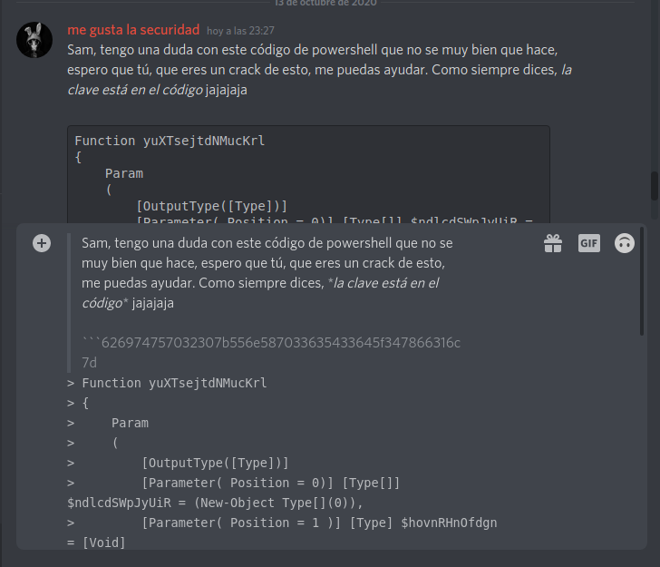

# Savito

## Puntos

* Puntuación Máxima `100`
* Puntuación Mínima `50`
* Decadencia `10`

## Pista

None

## Flag

`bitup20{UnXp3cT3d_4xf1l}`

## Adjuntos

None

## Deploy

None

## Descripcion

Todo apuntaba a esos chats de Discord, no sabemos cómo, pero lo hizo, pasó desapercibido... estuvo por semanas en los sistemas y se lo llevó todo, pero... tras analizar bien las conversaciones, no hemos visto nada... Quizás tú seas más hábil y puedas ver algo que nosotros no. Aquí tienes el enlace:

https://discord.gg/MEpYwWP

## Solucion

De la descripción del reto, podemos extraer la idea abstracta acerca de un atacante que ha estado por semanas en unos sistemas, y ha filtrado información sensible de la empresa. 

Se nos dice que todo apunta a un canal de Discord y nos proporcionan un link a un servidor de discord (el de Bitup), si entramos al servidor con el link proporcionado, podemos ver que en el grupo de entrada, hay un mensaje anclado, si nos fijamos en el mensaje veremos que dice así:

"Sam, tengo una duda con este código de powershell que no se muy bien que hace, espero que tú, que eres un crack de esto, me puedas ayudar. Como siempre dices, la clave está en el código jajajaja"



El [código](files/code.ps1) en sí, es sólo una distracción, además podemos comprobar que no hay ningún Sam en el chat, aun así, la clave está en el código, literalmente, pero no en el código de la función, sino del mensaje, pues podemos ver que el mensaje está formateado y a priori, no se ve nada a simple vista, pero si le damos a "citar mensaje" podemos ver que tras los backticks que se utilizan para dar formatear el código, hay un mensaje codificado.



```
626974757032307b556e587033635433645f347866316c7d
```

De los anteriores retos, podemos ver que esta en hexadecimal, así que lo pasamos a ascii code y podemos ver el siguiente mensaje, donde se indica la Flag del reto.

## Referencias

> Un gran abrazo desde aquí a S4vitar, la idea original (o al menos donde yo lo escuché fue en uno de sus directos) y me pareció digna de formar parte de una prueba, aunque sea muy tonta, del CTF de Bitup. Pasaros a ver su canal de youtube y que disfruteis del contenido que da:

* https://www.youtube.com/c/s4vitar/
