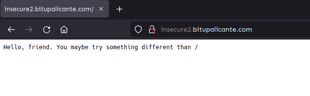
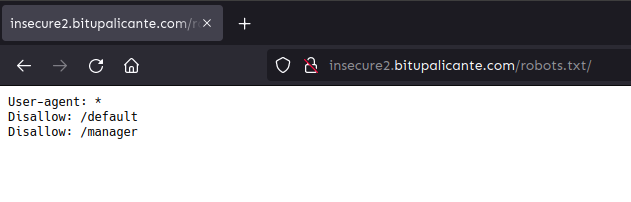
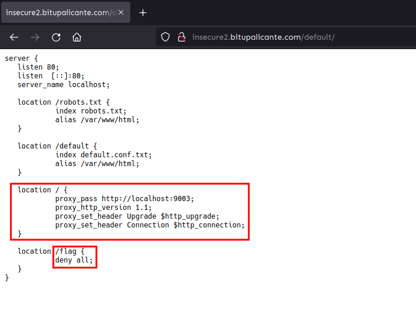
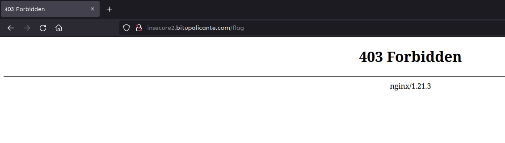
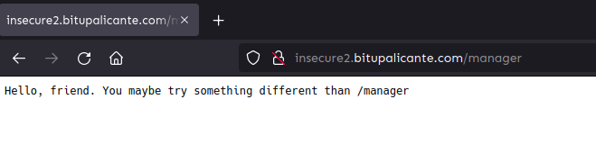
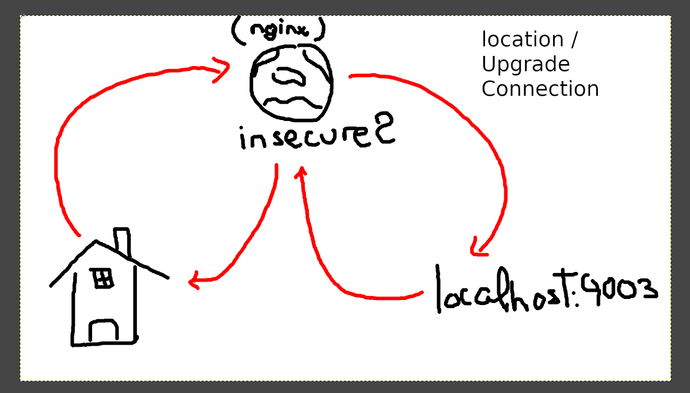
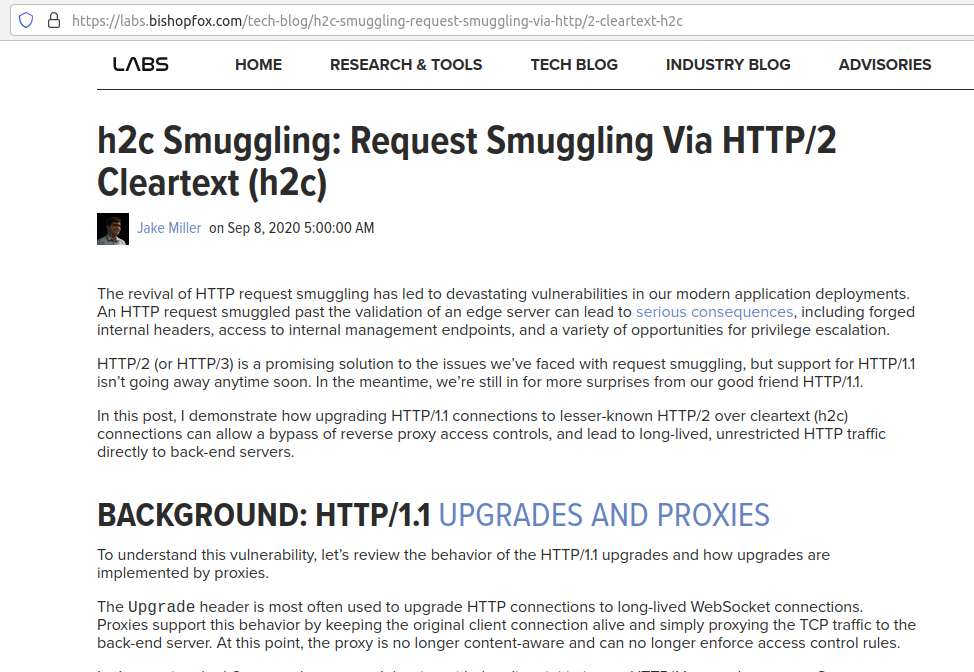
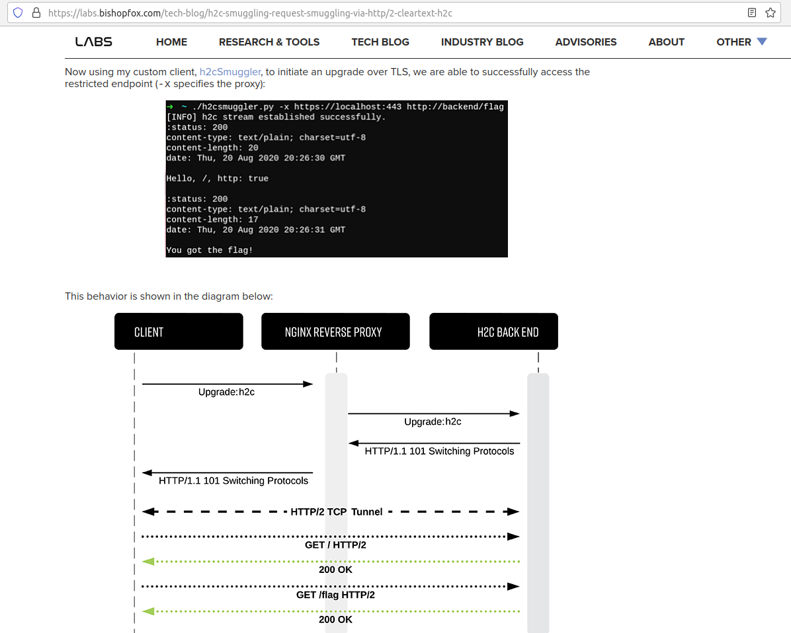
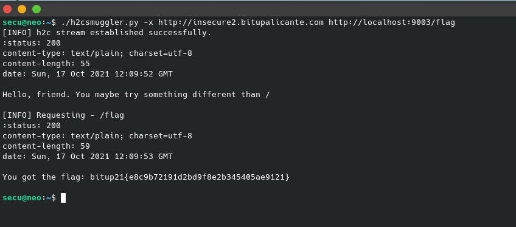

# Insecure2

## Index

[[_TOC_]]

## Points

* Difficulty: Easy
* Maximum Score `150`
* Minimum Score `50`
* Decadence `15`

## Hints

None

## Flag

`bitup21{e8c9b72191d2bd9f8e2b345405ae9121}`

## Attachments

None

## Deploy

Click [here](deploy) to see how to deploy the challenge with Docker. 

## Requirements

**Docker** is required to deploy the challenge.

## Description

Hello Friend,
I'll confess something... 
you know what they say about "second parts were never good", 
well... sometimes it happens, and it's quite right. 

Remember... look at the details, because the devil is in the details.

## Writeup

Initially, the URL to be analysed is obtained from the description of the challenge. When entering it from any browser we can see the following:

As you can see, there is not much information on the home page. If you proceed to consult the "robots.txt" file, you can find a directive that disables automatic indexing:

Visiting that Endpoint "/default", you get the contents of what appears to be an NGINX configuration file.

Analysing the content you can see an endpoint "/flag", if you try to visit it you get a 403 "Forbidden" error and, in addition, you can see a NGINX banner at the bottom of the page. Therefore, everything points to the fact that the configuration found in "/default" may be the one that is currently running on the NGINX web service that is running on the URL.

If we try to visit the endpoint /manager, we will see that it does not seem to give us any information either.

At this point, many people may have missed the point, but if you've mapped out what's going on and what you want to achieve, you may have found a way to bypass the reverse proxy.

All requests go through the reverse proxy and it is there that the policy blocking access to the /flag endpoint is applied. The goal is to make a direct connection against the web service on port 9003 and make the /flag request.

This can be exploited by using HTTP/2 Cleartext (h2c). This process is often used legitimately with Websockets, what is done is to start an HTTP/1.1 request of the upgrade type with the aim of achieving a bidirectional communication channel using the HTTP/2 protocol between client and server. The problem with this, is that, the initial communication is: CLIENT->REVERSE PROXY->SERVER, and when upgrading to HTTP/2 the communication is reused to transmit data with this new protocol. 

The impact of this is that, as soon as we start communicating directly with the server, the directives imposed by the reverse proxy cease to have any effect. In this way, it is possible to circumvent the "/flag" endpoint restriction imposed by NGINX. 

To better understand this vulnerability, you can access the [following Bishop's article](https://labs.bishopfox.com/tech-blog/h2c-smuggling-request-smuggling-via-http/2-cleartext-h2c) where they explain it in great detail.

So, after having read the post and understood the technical details of the vulnerability, the exploitation is quite trivial, as you can use the tool indicated in the post, called "h2csumggler" with the following command:

`./h2csmuggler.py -x http://insecure2.bitupalicante.com http://localhost:9003/flag`

Thus obtaining the flag of the challenge:

## Notes

It should be noted that the service listening on port 9003 has a particular configuration that allows it to handle a connection upgrade request and establish a direct connection. You can take a look at the code in [server.go](deploy/src/h2c-golang-server/server.go).

## References

* https://labs.bishopfox.com/tech-blog/h2c-smuggling-request-smuggling-via-http/2-cleartext-h2c
* https://github.com/thrawn01/h2c-golang-example
* https://github.com/BishopFox/h2csmuggler

## Author

@Secury
